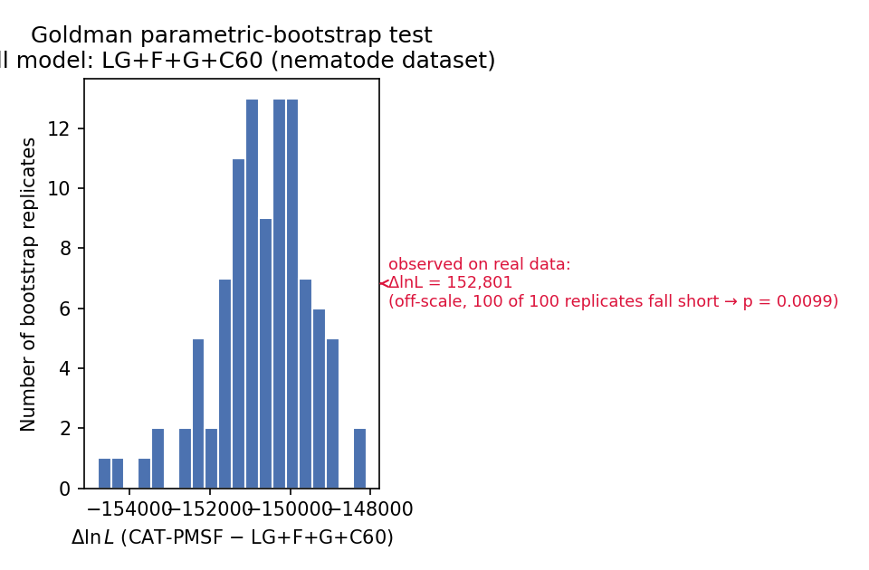

# Goldman parametric-bootstrap test: LG+C60 vs. CAT-PMSF

A worked, fully-reproducible tutorial for running the **Goldman (1993)
parametric-bootstrap likelihood-ratio test** to compare the fit of a
site-heterogeneous-mixture model with a fixed number of categories
(**LG+F+G+C60**) against a **CAT-PMSF** model on a real phylogenomic
alignment.

Every command below was actually run to produce the files checked into this
repository — this is not pseudocode. The worked example uses the classic
**37-taxon, 35,371-site Nematoda alignment** — one of the classic datasets
over which the CAT-PMSF pipeline was originally tested (Szánthó et al.
2023) — a well-known long-branch-attraction (LBA) test case for the
placement of Nematoda within Ecdysozoa. This approach can be used to
compare as many models as necessary; however, this repo isolates a
**two-model comparison — LG+F+G+C60 (null) vs. CAT-PMSF (alternative)** —
as a compact, self-contained example anyone can rerun end to end.

We implemented this approach in Yang et al. (in press) *A Comprehensive
Phylogenomic Framework for Brachiopod Evolution among Lophotrochozoans*,
Science Advances. The full citation will be added when the paper is
published. You will be able to use the results of Yang et al. (in press)
as a second example illustrating how the approach generalises.

This test **supersedes the property-specific parametric-bootstrap test we
introduced in Giacomelli et al. (2024)**. That earlier test assessed model
fit one data-property at a time (e.g. compositional heterogeneity, amino-
acid diversity), which is informative but inherently one-dimensional and
does not guarantee that a model favoured on one property is the
better-fitting model overall. The Goldman-style test implemented here
evaluates overall likelihood-based fit directly, sidesteps that
limitation, and should now be preferred (see §1 for why the same logic
also lets it stand in for AIC-based comparisons, which cannot be applied
to CAT-PMSF).

**Result on the nematode dataset:** CAT-PMSF fits significantly better than
LG+F+G+C60 (p = 0.0099, the smallest value estimable from 100 bootstrap
replicates — see [Results](#results)).

---

## 1. Background: what the test does and why

Fitting a richer model (CAT-PMSF) will *always* produce a higher
log-likelihood than a simpler, nested-in-spirit model (LG+F+G+C60) on any
dataset, purely because it has more free parameters. The question the
Goldman test answers is: **could that improvement have arisen by chance,
even if the simpler model were the true generating process?**

The motivation for using a Goldman (1993)-based parametric-bootstrap
likelihood-ratio test is that it is not possible to cleanly enumerate the
number of parameters used by PMSF-based models, which precludes the use of
information-criterion-based relative model-fit tests such as the AIC. The
use of a parametric-bootstrap likelihood-ratio test instead was originally
proposed by Wang et al. (2018).

The logic (parametric-bootstrap LRT framework as applied to PMSF-type
models by Wang et al. 2018):

1. Fit both models to the real data and record the difference in
   log-likelihood: `ΔlnL_real = lnL(CAT-PMSF) − lnL(LG+F+G+C60)`.
2. Treat the **simpler** model (LG+F+G+C60) as the null model. Simulate
   `N` replicate alignments of the same size under this null model and its
   ML tree (parametric bootstrap).
3. For every simulated replicate, fit LG+F+G+C60 from scratch (full tree
   search, branch lengths, C60 weights, and gamma shape all re-estimated),
   and separately score the same replicate under the **frozen CAT-PMSF
   model estimated from the real data** — record
   `ΔlnL_sim,i = lnL(CAT-PMSF, frozen model estimated from the real data) − lnL(LG+F+G+C60, re-estimated)`
   for each replicate `i`.

   **"Frozen" here means the CAT-PMSF *model* — the per-site amino-acid
   frequency profiles in `nema2.sitefreq`, estimated once from the real
   data in Step 3 — is reused as-is for every replicate. You do *not*
   rebuild a new PMSF model (i.e. rerun PhyloBayes CAT + `readpb_mpi` +
   `convert-site-dists.py`) for each of the 100 simulated replicates —
   that would be circular (the profiles would be fit to the very data
   being tested) and computationally infeasible (each PhyloBayes chain
   alone takes hours–days). What *is* still fit per replicate, for both
   models, is a completely ordinary IQ-TREE ML search — tree topology,
   branch lengths, and gamma shape are all re-optimized for that
   replicate under the frozen profile; see the log excerpt in §7.2.**
4. Because the simulated replicates were generated under the null model,
   the distribution of `ΔlnL_sim` shows how much of an apparent advantage
   the richer model can gain **purely from chance / extra parameters**,
   with no real additional structure in the data to exploit.
5. Compare `ΔlnL_real` against that null distribution:

   ```
   r = number of replicates with ΔlnL_sim,i ≥ ΔlnL_real
   p = (r + 1) / (N + 1)
   ```

   A small p-value means the real data's preference for CAT-PMSF is not
   something LG+F+G+C60 could produce by chance — i.e. CAT-PMSF is
   capturing genuine site-compositional heterogeneity that LG+F+G+C60 does
   not.

CAT-PMSF is used as the alternative model, rather than plain PhyloBayes
CAT, because CAT-based models don't have a well-defined, enumerable number
of free parameters (they're inferred as posterior-mean site-frequency
profiles from an MCMC sample), which rules out AIC. The parametric-
bootstrap LRT sidesteps that problem entirely — it never needs to count
parameters — which is precisely why it's the appropriate test here.

---

## 2. Repository layout

```
data/                          Nematoda.phy — the nematode alignment (Szánthó et al. 2023 dataset)
01_ml_tree/                     Step 1: site-homogeneous-mixture ML tree under LG+F+G+C60
02_phylobayes_cat/                Step 2: PhyloBayes CAT-Poisson MCMC + posterior mean site frequencies
03_pmsf_fit/                       Step 3: CAT-PMSF fit on the real data
04_goldman_test/                     Step 4: AliSim simulation + refits + the Goldman test itself
  ├─ run_ALISIMlgC60.sh                command used to simulate 100 replicates under the null model
  ├─ scripts/                          refit_LGC60.sh, refit_PMSF.sh, compute_goldman_pvalue.py
  ├─ example_simulated_data/           3 example simulated alignments + their real fits (full set is 100; see §7.1)
  ├─ simulated_fits/                   the .iqtree summary output for ALL 100 replicates, both models
  └─ results/                          nematode_goldman_deltas.csv, goldman_test_nematode.png
```

Every `output/` and `results/` subfolder contains **real output files**
from the actual run, not placeholders — open any `.iqtree` file to see the
full model, tree, and likelihood report IQ-TREE produced.

> **A note on file names.** The alignment is shipped in this repo as
> `data/Nematoda.phy`. In the raw IQ-TREE/PhyloBayes log and report files
> checked in under `01_ml_tree/output/`, `02_phylobayes_cat/`, and
> `03_pmsf_fit/output/`, you will see the alignment referred to internally
> as `nematode2.phy` — this is simply the literal filename that was on
> disk when those commands were actually run (the dataset had been
> downloaded twice during the original analysis, and the duplicate name
> was never cleaned up before the runs). It is the same alignment as
> `data/Nematoda.phy`; we've renamed the shipped data file and the scripts
> in this repo, but did not rewrite the historical log content, since that
> would misrepresent what was actually run.

---

## 3. Requirements

| Tool | Version used | Notes |
|---|---|---|
| [IQ-TREE](https://github.com/iqtree/iqtree3) | 3.1.2 | IQ-TREE 2 (≥2.2) also supports `-fs`/PMSF and `--alisim`; commands below are compatible with either binary (`iqtree3` used here, `iqtree2`/`iqtree` also work) |
| [PhyloBayes MPI](https://github.com/bayesiancook/pbmpi) (`pb_mpi`, `readpb_mpi`) | pbmpi-master | any recent build works |
| Python 3 | 3.9+ | `numpy` for `convert-site-dists.py`; `matplotlib` (optional) for plotting |

```bash
# Conda example
conda create -n goldman-pmsf -c bioconda -c conda-forge iqtree=3.1.2 phylobayes-mpi python=3.11 numpy matplotlib
conda activate goldman-pmsf
```

Steps 1, 3, and the per-replicate refits in Step 4 are CPU/RAM heavy for a
35,371-site alignment. Step 2 (PhyloBayes) needs MPI and is by far the
slowest step (hours–days depending on chain length and hardware); the
original run here used up to 96 MPI ranks across 3 nodes on a SLURM
cluster.

---

## 4. Step 1 — Site-heterogeneous-mixture ML tree (LG+F+G+C60)

```bash
cd 01_ml_tree
iqtree3 -s ../data/Nematoda.phy -m LG+F+G+C60 -nt 16
```

This both (a) gives the ML tree and branch lengths used as the fixed guide
topology for the PhyloBayes CAT run in Step 2, and (b) *is* the null model
used later in the Goldman test — its outputs
(`output/Nematoda.phy.{iqtree,log,treefile,bionj,mldist}`) are the "real
data, LG+F+G+C60" fit referenced throughout.

**Real result:** `Log-likelihood of the tree: -712617.3131`
(`output/Nematoda.phy.iqtree`), gamma shape α = 0.5408.

---

## 5. Step 2 — PhyloBayes CAT-Poisson MCMC and posterior mean site frequencies

### 5.1 Run two independent MCMC chains

Two chains are run on the fixed Step-1 topology so that convergence between
them can be checked (a single chain cannot tell you whether it has
converged).

```bash
cd 02_phylobayes_cat
pb_mpi -d ../data/Nematoda.phy -T ../01_ml_tree/output/Nematoda.phy.treefile -nmax 15000 -poisson -cat -f nema1
pb_mpi -d ../data/Nematoda.phy -T ../01_ml_tree/output/Nematoda.phy.treefile -nmax 15000 -poisson -cat -f nema2
```

(`run_cat.sh` shows this launched under SLURM/MPI with `srun -n 96`; adjust
to your own scheduler. `-poisson -cat` is the CAT-Poisson model; `-nmax`
caps the run at 15,000 cycles. The chain-name prefixes `nema1`/`nema2` are
just short labels for "Nematoda" chosen at launch time — they are
independent of the alignment's file name.)

### 5.2 Check convergence

```bash
tracecomp -x <burnin> nema1 nema2
```

Convergence is judged by effective sample size (ESS) > 100 and relative
difference between chains < 0.3 for every parameter. The real
`output/tracecomp.contdiff` from this run:

```
name                effsize   rel_diff
loglik              146       0.0987
length              1473      0.0142
alpha               912       0.1038
Nmode               256       0.0712
statent             537       0.0817
statalpha           387       0.0225
```

All parameters pass both thresholds.

### 5.3 Extract posterior-mean site-specific profiles

Note we have arbitrarily chosen chain `nema2` here — as convergence has
already been reached between the two chains, the choice of which chain to
extract profiles from is irrelevant.

```bash
readpb_mpi -x 6000 67 12755 -ss nema2
```

`-x <burnin> <every> <until>` discards the first 6,000 cycles as burn-in
and subsamples every 67th point up to cycle 12,755 — (12755−6000)/67 ≈ 100
posterior samples averaged into the site profiles. `-ss` writes
`nema2.siteprofiles` (one posterior-mean amino-acid frequency vector per
alignment column).

(`run_readpb_for_pmsf_RATE_RUN.sh` shows the analogous `-r` invocation for
per-site rates, `nema2.meansiterates`, not required for PMSF itself but
useful diagnostically.)

### 5.4 Convert to an IQ-TREE site-frequency file

```bash
python3 convert-site-dists.py nema2.siteprofiles
# -> writes nema2.sitefreq
```

`convert-site-dists.py` (included here) just re-orders PhyloBayes's
amino-acid column order into IQ-TREE's and renormalizes each site's
frequency vector. `nema2.sitefreq` is the CAT-PMSF *model* itself — this
is the file that gets frozen and reused, unmodified, throughout Step 4.

---

## 6. Step 3 — CAT-PMSF fit on the real data

```bash
cd 03_pmsf_fit
iqtree -s ../data/Nematoda.phy -m Poisson+G4 -fs ../02_phylobayes_cat/nema2.sitefreq -nt 32 -pre CAT_pmsf_
```

`-fs nema2.sitefreq` tells IQ-TREE to use a per-site empirical frequency
profile at every column instead of one exchangeability matrix for the whole
alignment — this is the PMSF approximation to the CAT posterior. IQ-TREE
still does a full ML tree search and branch-length optimization under this
model.

**Real result:** `Log-likelihood of the tree: -559816.0902`
(`output/CAT_pmsf_.iqtree`) — dramatically better than LG+F+G+C60's
−712,617.31 on the same 37×35,371 alignment (`output/nema2.sitefreq`, 7.7 MB,
is included so you can rerun this step or Step 4 without redoing Step 2).

This fit — tree, branch lengths, and above all `nema2.sitefreq` — is the
**frozen PMSF model estimated from the real data** referenced throughout
Step 4.

---

## 7. Step 4 — The Goldman test itself

### 7.1 Simulate 100 replicates under the null model (AliSim)

```bash
cd 04_goldman_test
iqtree3 --alisim nematoda_sim \
    -s ../data/Nematoda.phy \
    -m LG+C60+F+G4{0.5408} \
    -te ../01_ml_tree/output/Nematoda.phy.treefile \
    --site-freq SAMPLING \
    --site-rate SAMPLING \
    --length 35371 \
    --num-alignments 100 \
    -af fasta \
    -seed 42 \
    -T 32 \
    --prefix nematedes_alisim
```

- `-m LG+C60+F+G4{0.5408}` fixes the gamma shape at the value estimated on
  the real data in Step 1.
- `-te ...treefile` simulates on the Step-1 ML tree (branch lengths
  included).
- `--site-freq SAMPLING --site-rate SAMPLING` makes AliSim *sample* a
  C60 mixture-component and rate category for each site from their
  estimated weights, rather than using the profile-averaged frequency —
  this reproduces the mixture model's actual site-to-site heterogeneity
  instead of washing it out.
- `--length 35371 --num-alignments 100 -seed 42` simulates N = 100
  replicates of exactly the real alignment's length, with a fixed seed for
  reproducibility.

This produces `nematoda_sim_1.fa … nematoda_sim_100.fa`. Three examples are
included in `example_simulated_data/`; regenerate all 100 with the command
above (deterministic given `-seed 42`) rather than storing ~130 MB of
alignments in this repo.

### 7.2 Re-fit each replicate under LG+F+G+C60; score each replicate under the frozen PMSF model estimated from the real data

```bash
# Null model: everything free (topology, branch lengths, C60 weights, gamma shape)
./scripts/refit_LGC60.sh <path-to-100-fastas> simulated_fits/LGC60 32

# Frozen PMSF model estimated from the real data: reuse nema2.sitefreq (Step 3) as-is
./scripts/refit_PMSF.sh <path-to-100-fastas> ../03_pmsf_fit/output/nema2.sitefreq simulated_fits/PMSF 32
```

**"Frozen" applies to the CAT-PMSF *model* — i.e. the per-site
amino-acid frequency profiles in `nema2.sitefreq`, estimated once from the
real data in Step 3.** Do **not** rebuild a new PMSF model (rerun
PhyloBayes CAT + `readpb_mpi` + `convert-site-dists.py`) for each of the
100 replicates: that would fit the profiles to the very data being tested
(circular), and is computationally infeasible anyway — each PhyloBayes
chain alone runs for hours to days, and Step 2 is deliberately done
exactly once, on the real data. The same `nema2.sitefreq` file is simply
handed to IQ-TREE via `-fs` for every one of the 100 replicates.

What *is* still fit per replicate, for both models, is a completely
ordinary IQ-TREE ML search — tree topology, branch lengths, and gamma
shape are all re-optimized for that replicate. The real log for replicate
1 under the frozen PMSF model shows exactly this (from
`simulated_fits/PMSF/` — only the small `.iqtree` summaries are checked in;
this excerpt is from the corresponding full `.log`):

```
Generating 98 parsimony trees...
Do NNI search on 20 best initial trees
BETTER TREE FOUND at iteration 1: -869932.242
Iteration 100 / LogL: -869933.143
TREE SEARCH COMPLETED AFTER 102 ITERATIONS / Time: 0h:32m:37s
Optimal log-likelihood: -869932.241
Gamma shape alpha: 0.367
```

Note the resulting tree and branch lengths differ from replicate to
replicate, and the gamma shape (0.367 here) differs both from replicate to
replicate and from the real-data PMSF fit (0.5408 estimated in Step 1) —
only the site-frequency profiles themselves are held fixed.

Both refit commands wrap the exact commands recorded in the real run logs, e.g.
(`simulated_fits/LGC60/nematoda_sim_1_tree.iqtree`, header):

```
Command: iqtree3 -s nematoda_sim_1.fa -m LG+F+G+C60 -nt 32 -pre nematoda_sim_1_tree
```

and (`simulated_fits/PMSF/nematoda_sim_1_pmsf_.iqtree`, header):

```
Command: iqtree3 -s nematoda_sim_1.fa -m Poisson+G4 -fs nema2.sitefreq -nt 32 -pre nematoda_sim_1_pmsf_
```

`simulated_fits/{LGC60,PMSF}/` in this repo already contains the real
`.iqtree` summary file for **all 100 replicates** produced by these
commands (fasta alignments themselves are not stored — see §7.1).

### 7.3 Compute the p-value

```bash
cd scripts
python3 compute_goldman_pvalue.py \
    --lgc60-real  ../../01_ml_tree/output/Nematoda.phy.iqtree \
    --pmsf-real   ../../03_pmsf_fit/output/CAT_pmsf_.iqtree \
    --lgc60-sim-dir ../simulated_fits/LGC60 \
    --pmsf-sim-dir  ../simulated_fits/PMSF \
    --out-csv ../results/nematode_goldman_deltas.csv \
    --out-plot ../results/goldman_test_nematode.png
```

---

## 8. Results

Running the command above on the checked-in output files reproduces:

```
Real data:  lnL(LG+F+G+C60) = -712617.3131   lnL(CAT-PMSF) = -559816.0902
delta_real (PMSF - LG+C60)  = 152801.2229
Bootstrap replicates: N = 100
r (sim replicates with delta_sim >= delta_real) = 0
Goldman parametric-bootstrap p-value = (r+1)/(N+1) = 0.00990099
```



None of the 100 bootstrap replicates simulated under LG+F+G+C60 came
anywhere close to the ΔlnL observed on the real data (simulated ΔlnL ranges
from about −154,800 to −148,100, all *negative* — meaning on data actually
generated by LG+F+G+C60, the frozen PMSF model estimated from the real
data fits *worse*, as expected — versus +152,801 on the real alignment).
With r = 0 of N = 100, p = 0.0099, the smallest p-value obtainable from 100
replicates.

**Interpretation:** LG+F+G+C60 cannot explain the real nematode data even
approximately as well as CAT-PMSF does, and this gap is far too large to be
a fluke of extra free parameters. CAT-PMSF is capturing genuine
site-specific compositional heterogeneity in this alignment.

For a tighter p-value bound, increase `--num-alignments` in Step 7.1 (e.g.
to 999 for p as small as 0.001) — the smallest resolvable p-value is always
1/(N+1).

---

## 9. Running this on your own dataset

1. Replace `data/Nematoda.phy` with your alignment (any format IQ-TREE
   reads: phylip, fasta, nexus, clustal...).
2. Repeat Steps 1–3 unchanged (swap in your alignment path).
3. In Step 4.1, set `-m LG+C60+F+G4{<your alpha>}` from your own Step-1
   `.iqtree` output, `--length` to your alignment's site count, and
   `-te` to your own Step-1 treefile.
4. Everything else — the refit commands and `compute_goldman_pvalue.py` —
   is dataset-agnostic.

You can also test other model pairs (e.g. LG+F+G vs. LG+F+G+C60, or
LG+F+G vs. CAT-PMSF) by simulating under whichever model has the *lower*
real-data likelihood and re-fitting both models to each replicate the same
way — see `compute_goldman_pvalue.py --help` for the generic interface.

---

## 10. References

- Goldman N. (1993). Statistical tests of models of DNA substitution.
  *Journal of Molecular Evolution* 36:182–198.
- Wang H.-C., Minh B.Q., Susko E., Roger A.J. (2018). Modeling Site
  Heterogeneity with Posterior Mean Site Frequency Profiles Accelerates
  Accurate Phylogenomic Estimation. *Systematic Biology* 67(2):216–235.
  https://doi.org/10.1093/sysbio/syx068 — introduces PMSF and originally
  proposes the parametric-bootstrap LRT framework used here.
- Giacomelli M., Vecchi M., Guidetti R., Rebecchi L., Donoghue P.C.J.,
  Lozano-Fernandez J., Pisani D. (2024). CAT-Posterior Mean Site
  Frequencies Improves Phylogenetic Modeling Under Maximum Likelihood and
  Resolves Tardigrada as the Sister of Arthropoda Plus Onychophora.
  *Genome Biology and Evolution* 17(1):evae273.
  https://doi.org/10.1093/gbe/evae273 (published online Dec. 2024; print
  volume 2025) — introduced a property-specific parametric-bootstrap
  goodness-of-fit test for CAT-PMSF. **The Goldman-style test implemented
  in this repository supersedes that earlier test** (see §1).
- Szánthó L.L., Lartillot N., Szöllősi G.J., Schrempf D. (2023).
  Compositionally Constrained Sites Drive Long-Branch Attraction.
  *Systematic Biology* 72(4):767–780.
  https://doi.org/10.1093/sysbio/syad013 — introduced the CAT-PMSF
  pipeline used in Steps 1–3 below and the 37-taxon Nematoda dataset used
  as this tutorial's worked example.
- Yang M., Butler A., López Carranza N., Vinther J., Whittle R., Henkel
  D., Jurikova H., Wörheide G., Giacomelli M., Donoghue P.C.J., Pisani D.,
  Carlson S.J., Sperling E.A. (in press). A Comprehensive Phylogenomic
  Framework for Brachiopod Evolution among Lophotrochozoans. *Science
  Advances*. Full citation to be added on publication — applies this exact
  Goldman-test protocol to a real empirical case (brachiopod/
  lophotrochozoan phylogenomics).
- Minh B.Q., Schmidt H.A., Chernomor O., Schrempf D., Woodhams M.D., von
  Haeseler A., Lanfear R. (2020). IQ-TREE 2: New Models and Efficient
  Methods for Phylogenetic Inference in the Genomic Era. *Molecular
  Biology and Evolution* 37:1530–1534.
- Ly-Trong N., Naser-Khdour S., Lanfear R., Minh B.Q. (2022). AliSim: A
  Fast and Versatile Phylogenetic Sequence Simulator for the Genomic Era.
  *Molecular Biology and Evolution* 39(5):msac092.
- Lartillot N., Rodrigue N., Stubbs D., Richer J. (2013). PhyloBayes MPI:
  Phylogenetic Reconstruction with Infinite Mixtures of Profiles in a
  Parallel Environment. *Systematic Biology* 62(4):611–615.
